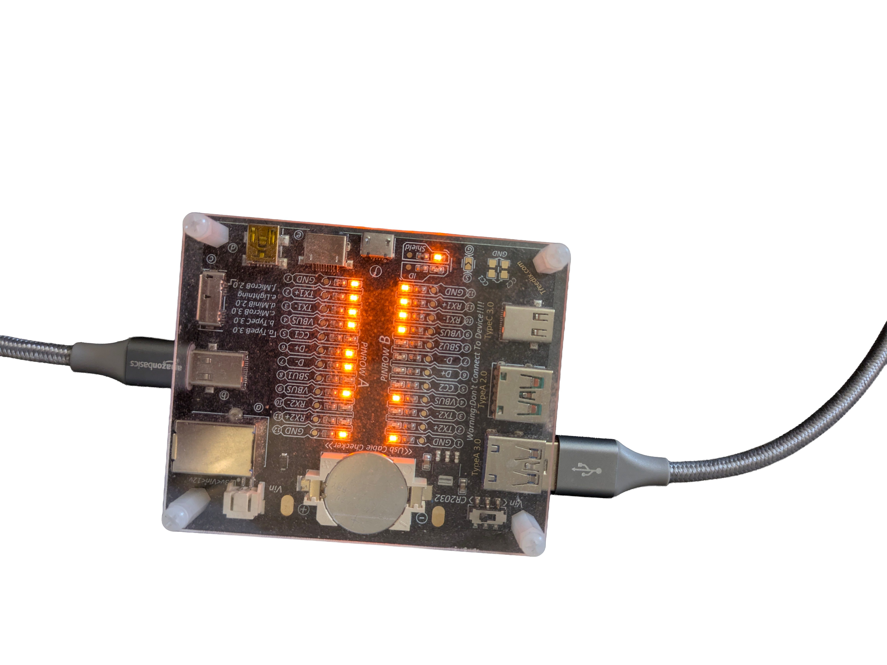

# USB Cable Testing

This project documents a measurement-based investigation of USB charging cables.

## Problem

Some USB cables charged devices more slowly than others or showed unstable connections.

## Goal

The goal was to identify unreliable cables and separate cable problems from charger or device problems.

## Method

A USB cable tester was used to check cables instead of judging them only by appearance.

## Result

Several cables with cable breaks or unstable connections could be identified.

## What this project shows

This project shows a practical measurement-based approach:

- Compare similar components under real conditions
- Use a tester instead of guessing
- Identify unstable connections
- Separate cable problems from charger or device problems
- Make a practical decision based on measurements

## Image

