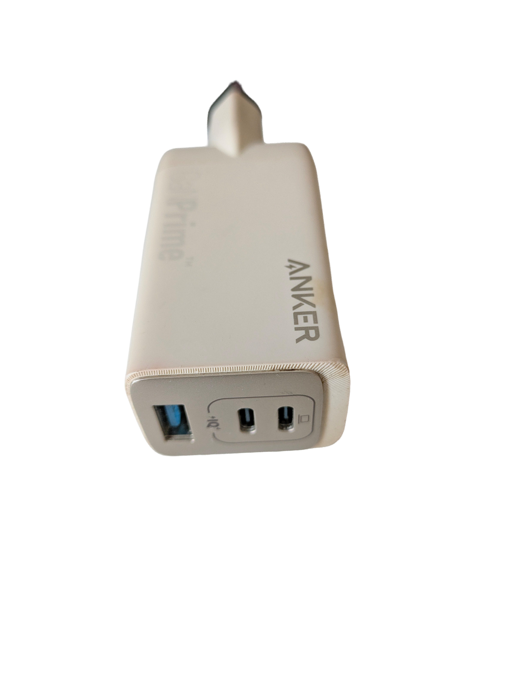

# X-ray USB Charger Inspection

This project documents a non-destructive inspection of USB chargers using an X-ray device at university.

## Problem

USB chargers from different manufacturers can look similar from the outside, but their internal construction and quality can differ strongly.

## Goal

The goal was to understand what is inside different USB chargers without destroying them and to compare their internal structure.

## Method

An X-ray device was used to inspect the chargers non-destructively.

The focus was on observing the internal layout, component placement, and general construction quality.

## What this project shows

This project shows a systematic approach to technical inspection:

- Inspect without destroying the object
- Compare internal structures
- Look for visible quality differences
- Use measurement or inspection tools to make hidden structures visible
- Document observations clearly

## Reference and inspiration

The decision to inspect and compare USB chargers was partly inspired by the charger test overview on lygte-info.dk:

https://lygte-info.dk/info/ChargerIndex%20UK.html

The page showed how strongly USB chargers can differ in construction and quality. My own project focused on a non-destructive visual inspection using an X-ray device at university.

## Images

